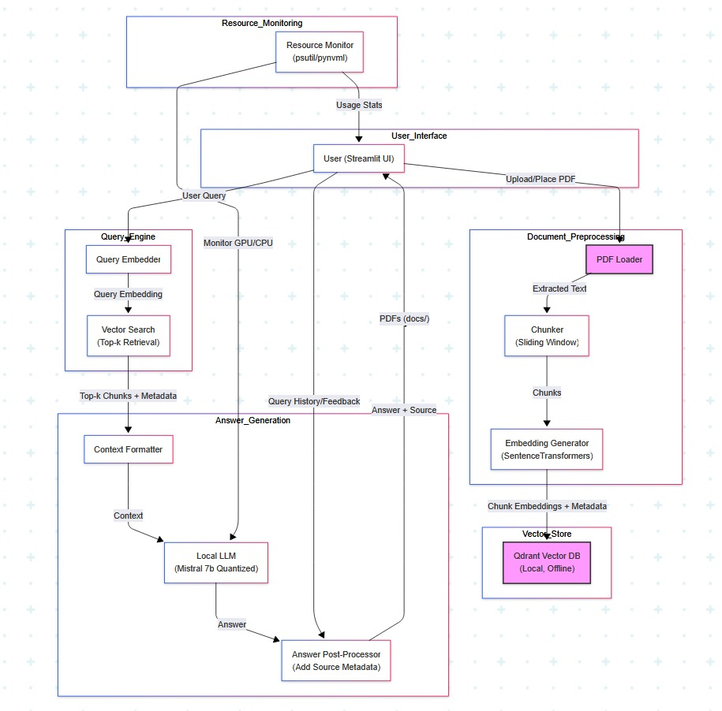

# RAPFlowBot – Conversational RAG Chatbot

## Project Overview
RAPFlowBot is a fully offline, production-ready Conversational Retrieval-Augmented Generation (RAG) chatbot developed for Rapid Acceleration Partners (RAP). It is designed to assist users in retrieving information from internal business documents (PDF format) using only open-source tools. The solution delivers precise, context-aware answers strictly based on document content while citing the document name, page, and section used.

---

## Objective
The chatbot helps business users query PDF content directly using natural language, aiding in RAP’s mission of “Practical AI Solutions for Digital Business Transformation.” It is designed for complete offline usage, ideal for secure enterprise deployments.

---

## Key Features
- Retrieval-Augmented Generation (RAG) pipeline
- PDF parsing + semantic chunking (Sliding Window)
- Sentence embeddings via `SentenceTransformers`
- Vector search using `Qdrant` (local + offline)
- Answer generation via quantized `Mistral 7B` (LLM)
- Cited source metadata: filename, page number, and chunk ID
- Streamlit UI for user-friendly interaction
- No internet, no LangChain, no paid APIs
- Compatible with GPU: Tesla T4 or 16GB VRAM devices

---

## System Architecture



### High-Level Modules
1. **Document Preprocessing**: PDF loader, chunker, and embedding
2. **Vector Store**: Qdrant for offline vector search
3. **Query Engine**: One-pass embedding + retrieval
4. **Answer Generator**: Local LLM (Mistral 7B or TinyLLaMA)
5. **User Interface**: Lightweight Streamlit app
6. **Resource Monitor**: GPU/CPU usage tracking via `psutil` and `pynvml`

### Architectural Decisions
- Chose Qdrant for lightweight, offline vector DB with fast cosine search.
- Avoided LangChain to keep implementation transparent and fully customizable.
- Selected Mistral 7B Instruct GPTQ for quantized performance under 16GB GPU memory.
- Used Streamlit for quick UI iteration and offline local deployment.

---

## Setup & Installation

### Environment Setup
```bash
python -m venv venv
source venv/bin/activate  # Windows: venv\Scripts\activate
pip install -r requirements.txt
```

### Launch Local Qdrant
```bash
docker run -p 6333:6333 -v qdrant_storage:/qdrant/storage qdrant/qdrant
```

---

## How to Use

### Place PDFs
Copy your PDF files to `./docs/`

### Run the Application
```bash
python app.py
```
Use the Streamlit interface to ask questions.

---

## Chunking Strategy
We use **sliding window** chunking to avoid cutting off context mid-sentence:
- `chunk_size = 750 characters`
- `overlap = 50 characters`

Each chunk includes metadata like:
```json
{
  "filename": "DATASET1.pdf",
  "page_number": 2,
  "chunk_id": "uuid..."
}
```

---

## Retrieval Strategy
- Single query embedding via `all-MiniLM-L6-v2`
- Qdrant used for **Top-1 cosine similarity match**
- Retrieved chunk formatted and passed to the LLM
- Final response includes **document traceability**

### Prompt Template
```
You are a helpful assistant. Use the below context to answer the question.
If the answer is not present in the context, respond with "I don't know."

Context:
{retrieved_chunk}

Question: {user_query}
Answer:
```

---

## Observations
- Answer generation consistently remained within the 15-second GPU constraint.
- The sliding chunking approach helped ensure completeness of response.
- One-shot vector search helped reduce latency and improved accuracy by reducing noise.

---

## Model Details
- **Embedding Model**: all-MiniLM-L6-v2
- **LLM**: Mistral-7B Instruct GPTQ (4-bit quantized)
- **Quantization**: AutoGPTQ with `trust_remote_code=True`
- **Answer Generator**: `transformers.pipeline` text-generation

---

## Hardware & Performance
- GPU: Tesla T4 (16GB VRAM)
- CPU: 8-core minimum suggested
- RAM: 16GB+
- Average Latency: ~9–12 seconds per query
- Inference framework: PyTorch
- Optimized with `torch.inference_mode()` + garbage collection

---

## Resource Monitoring
- GPU stats via `pynvml`
- CPU and memory stats via `psutil`
- Query duration displayed in Streamlit

---

## Example User Queries

### DATASET1.pdf
1. What percentage of accounting tasks can be automated?
2. How does IPA help in hotel night audits?
3. What is the human role in automated accounting?
4. Describe risks associated with manual audits.
5. What pain points exist in accounts payable?

### DATASET2.pdf
6. What are the benefits of RAPFlow for finance teams?
7. How does RAPbot streamline business processes?
8. What did Levvel Research report on IPA?
9. How do AI tools impact mortgage workflows?
10. What is the value of gamification in KPOs?

---


